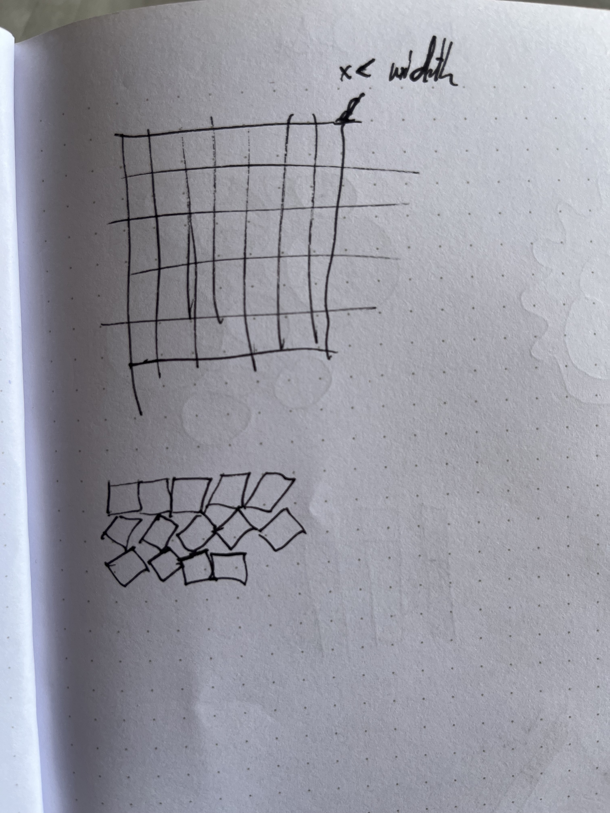

# Day 02 - Grids

## Simple Line Grid
I have never programmed a Grid before and wanted to start from scratch without using pre-existing code. After refreshing for and while loops I started programming a very basic grid made out of horizontal and vertical lines. 

here a very boring and obvious sketch I made (including the next step):

Here the result:


<iframe src="content/day01/03/embed.html" width="400" height="400" frameborder="no"></iframe>


## Square Grid
I continued with a grid made in a nested loop function using squares.
After getting this function to work I randomized the fill color of the squares giving it all a painful iridescent look.


<iframe src="content/day03/04/embed.html" width="400" height="400" frameborder="no"></iframe>


### Rotated Square Grid
As implied by the sketch above, I wanted to cumulatively rotate the angle of the squares so each one is rotated a bit more than the one before. This got a bit trickier and the rest of the day I spent watching videos about how to use the rotate and the translate functions. I also learned how hard it is to specify to ChatGPT what exactly you want and how important knowledge of coding is.
In the end of the day I got it though:

* sadly I lost my code here. So I leave you with a happy accident. *


<iframe src="content/day01/02/embed.html" width="400" height="400" frameborder="no"></iframe>


