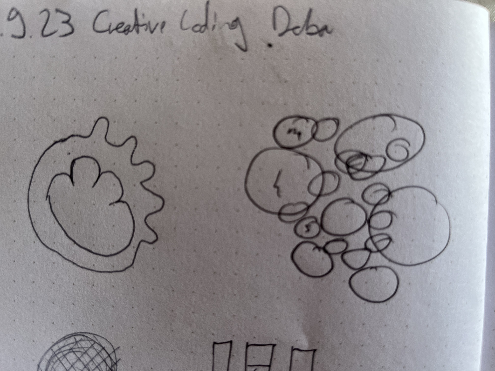

# Day 03 - Clocks

## Sketches

Playing around with chatGPT I tried to make a clock that adds a transparent circle each second. Once again the solution it provided was counter intuitive. It didn't use the functions (minutes, seconds, hours) recommended in the course but rather millisecond intervals. 

## The Bar Clock
After wasting some time trying to adapt this solution I decided to take a whole other approach and make a very basic clock out of 3 bars each indicating either seconds, minutes or hours. For this I used the Coding Train video. I also for the first time used a mapping function which I will most certainly use very often in the future! :D


<iframe src="content/day02/01/embed.html" width="600" height="600" frameborder="no"></iframe>


## Triangle Clock
First I wanted to smoothen the movement between seconds so it looked like a linear loading bar, to kinda play around with the way we read time, but then I had the idea to shape the 3 bars into a triangle, so that once a bar is full it kinda just tips over into the next bar. I tried to use the rotate function to rotate the bars but I failed at math I guess.


<iframe src="content/day02/02/embed.html" width="400" height="400" frameborder="no"></iframe>

