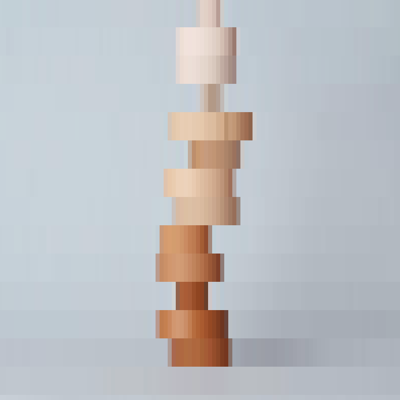
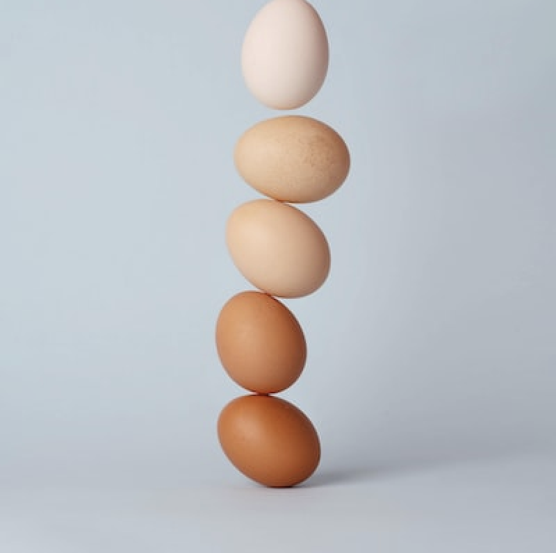

# Day 07 - Pixels (and a bit of Grids)

This day was partially looking at pixel stuff and partially revisiting some grid ideas since I wasn't very happy with how far I got the second day.

I remembered many gifs or videos, where a picture gets more and more pixelated. I kinda wanted to make this effect myself and wanted to make it controllable.

I used an idea that I learned from an old teacher of mine, Luc. He used the unsplash website to call up a different picture with every mouseclick.

I made to kinds of pixelation effects one following the mouse, one only influenced by it's movement. (Reload the picture by clicking.)


<iframe src="content/day07/01/embed.html" width="100%" height="500" frameborder="no"></iframe>



<iframe src="content/day07/02/embed.html" width="100%" height="500" frameborder="no"></iframe>


Playing around with this I had some funny moments.

Guess what kind of food this is:

.
.
.
.
.
.
.
.
.
.
.
.
.
.
.
.
.
.
.
.
.
.
.
Well:
