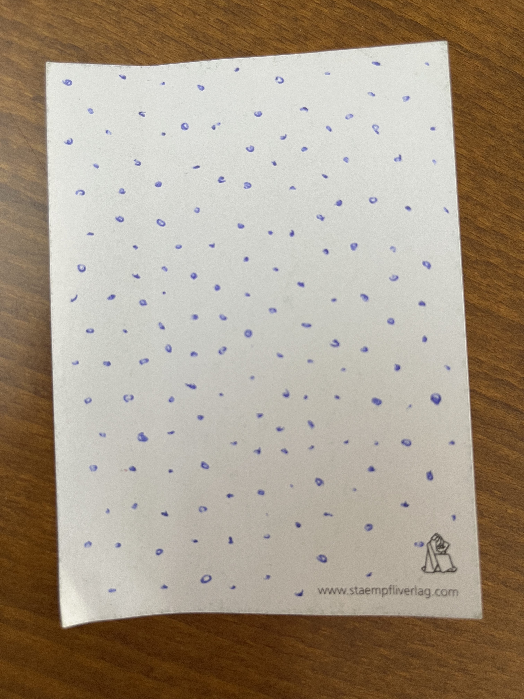

# Day 01

## Computing without computer

### Moniker: The beach (30 mns)

Roel: "entering the beach on a sunny day you will look for an empty place and position yourself right in the middle". - A fascinating form of self organization.

This small and rather odd exercise of drawing a dot in the biggest empty spaces - where you would lay down your towel on the beach if each dot would repressent another person - let's you feel like a robot. There is some kind of sensor which imidiatelly highlights the biggest white space on the paper if you stare at it. This exercise poses questions how an algorithm would choose the spots to draw the next point.

### Drawing exercises

Drew a little tree by hand and then programmed it in p5.js. I then got stuck designing some colorchanging christmass decoration.


<iframe src="content/day01/04/embed.html" width="100%" height="450" frameborder="no"></iframe>


